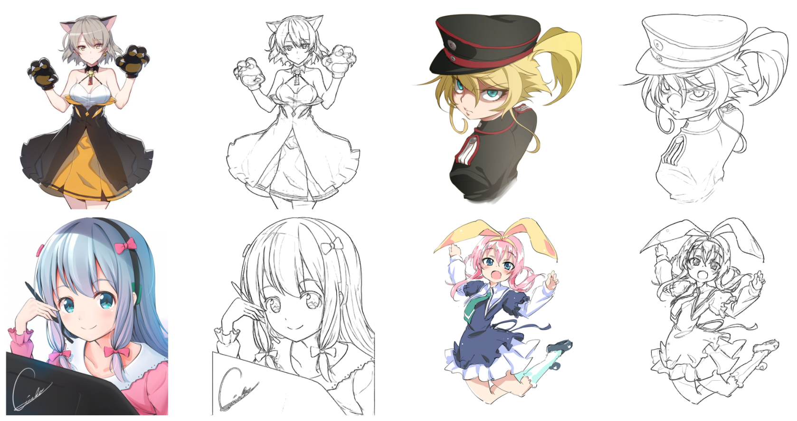
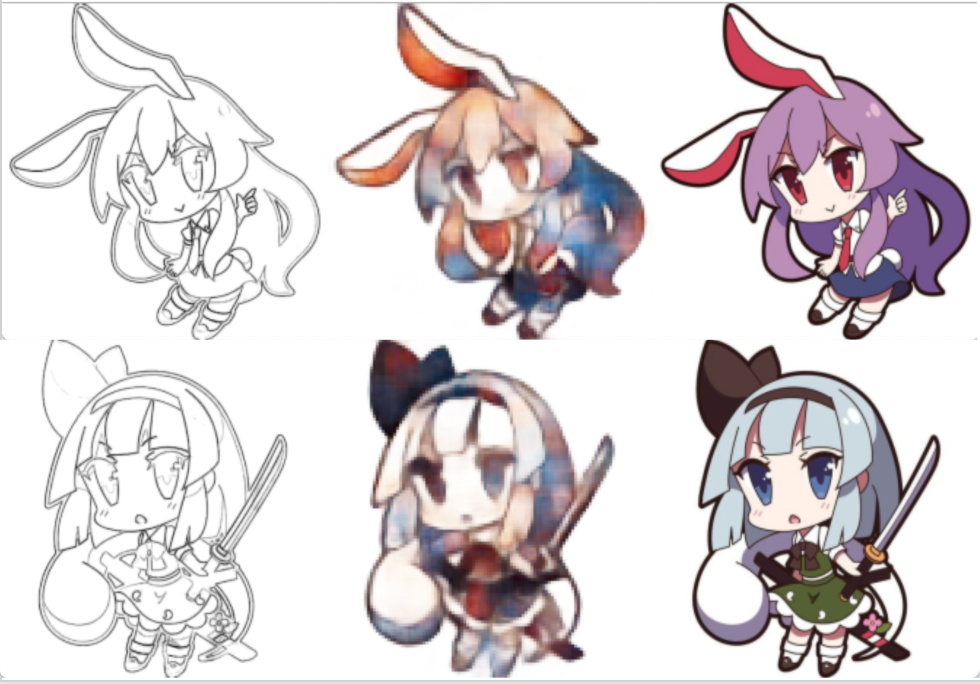
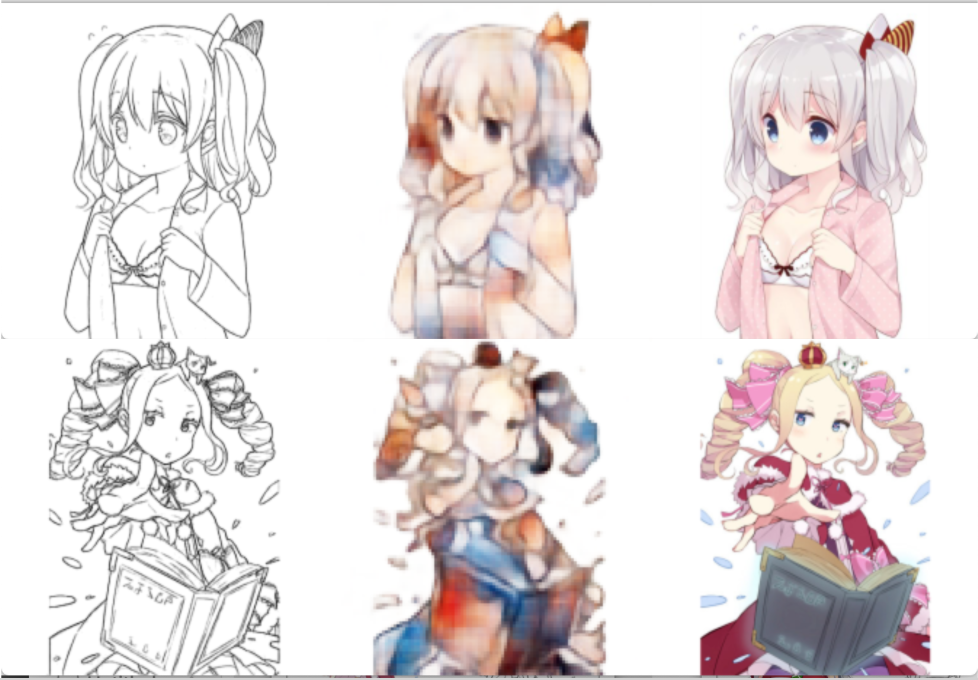

# Introduction

This implementation is about anime sketch colorization, I am trying some models just for curiosity. The current result came from a simple  Convolutional Autoencoder.

### Training on animes
<p></p>
<center>

</center>

### Requirement
```
python==3.7.0
tensorflow==2.1
```

### How to use
Training & Prediction can be run as follows:    
`python train.py train`  
`python train.py predict_one image.jpg`


### Implementation Note    

* **Note 1**:   
Since datasets are somehow huge and painfully slow in training ,I decided to make number of filters variable. If you want to run it on your PC, you can decrease or increase the number of filters into any number you like. (32 is by default). However, the performance of the model will be changed.
For example:  
`model = conv_ae.Conv_AE((None,height, width, channel), filters=16)`

* **Note 2** :   
You can also make the size of images smaller, so that it can be ran faster and doesn't take too much RAM.

### Results:
* img_size = 224, 224
* Learning rate = 0.00001
* Batch size = 8  
* Optimizer  = Adam   

Images from Left to Right: Sketch ---> Predicted  ---> Ground Truth
<center>
  
<p></p>
   
</center>
